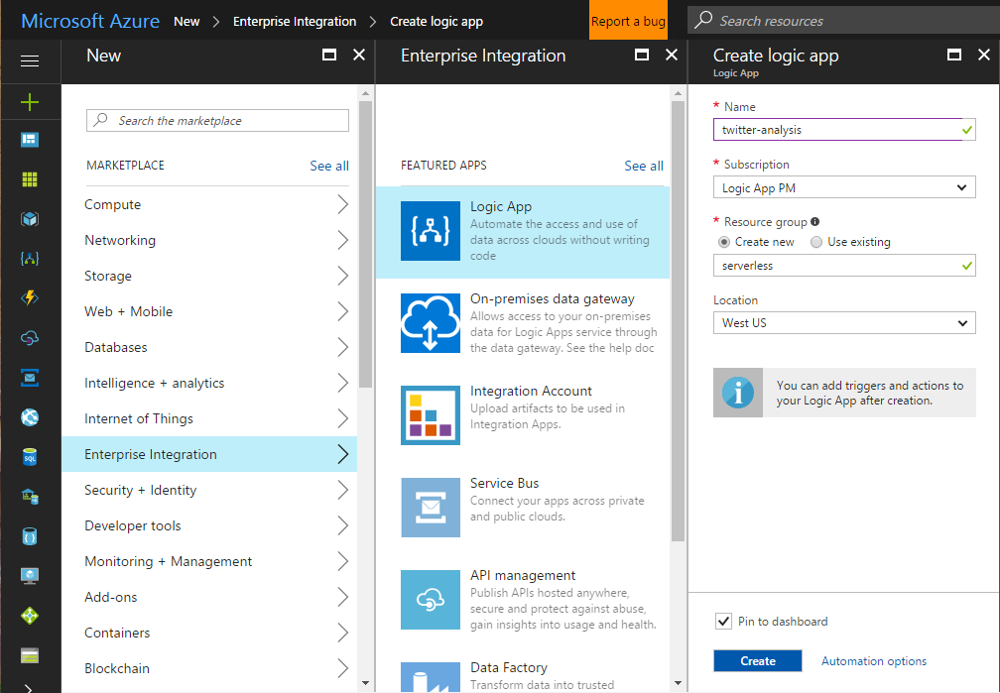
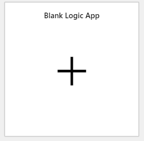
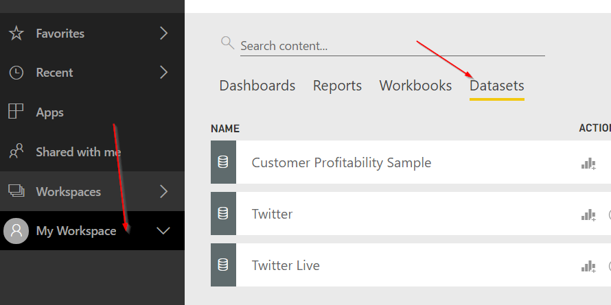
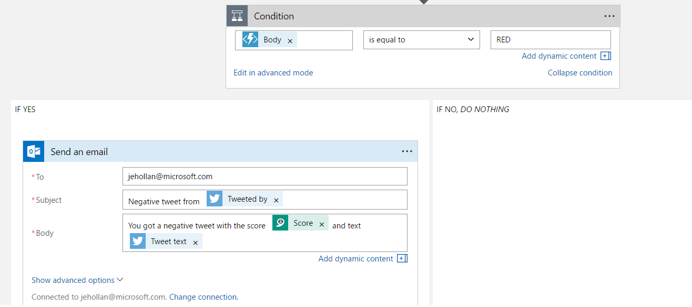

# Serverless Lab: Build a Social Dashboard

This lab will go over building a social dashboard using Azure Serverless technologies.  You can listen to any search term on Twitter and plot the sentiment, location, and key phrases of that tweet in real-time.

## Pre-requisites

The lab will all take place in the Azure Portal - so you will need an Azure Account.

* Azure Account
* Cognitive Services key for the **Text Analytics** API. You can sign up for a key here - but note it does sometimes take 10 minutes for key to activate: [Azure Portal create Cognitive Service](https://portal.azure.com/#create/Microsoft.CognitiveServices)
* Twitter Account
* *Optional* Power BI Account
* *Optional* Email Account (Outlook.com, Gmail, etc.)

## Getting started with the Logic App

1. In the [Azure Portal](https://portal.azure.com), click the **New** button, and under **Enterprise Integration** select **Logic App**
1. Give your logic app any name, resource group, and region that you want.  Click **Create**
    * I recommend pinning the logic app to your dashboard for quick access later  
      
1. Once the logic app has deployed, open it to view the designer
1. Click the **Blank Logic App** template to start from blank  
      

### Adding the trigger to twitter

Now that we are in the logic app designer, we can set the trigger for this app.  In this case we want to listen to new tweets from Twitter.

1. Click the **Twitter** connector and the **When a new tweet is posted** trigger.
1. Login with a twitter account to access the twitter search API
    * It will ask you to authenticate with your Twitter account. It's only the authenticate against the Tweet API and we won't be posting from the Logic App.
1. Configure the trigger for a search term to listen  
    ![Twitter trigger][1]
    * You can set the recurrence to a more frequent interval for faster updates, but a micro-charge is incurred for each poll on the Twitter API.  A single poll may return many tweets (so if you check every 3 minutes and in that 3 minutes 90 tweets are posted, all 90 tweets will be pulled in that one check).
1. Add a **New Step** and **Add an action**, notice all of connectors to different services
1. Add the **Text Analytics** connector and **Detect Sentiment** operation to detect the sentiment of the tweet.  Name the connection anything you want, and paste in a key.
    * You can sign up for a key here - but note it does sometimes take 10 minutes for key to activate: [Azure Portal create subscription](https://portal.azure.com/#create/Microsoft.CognitiveServices)
1. Select to add the **Tweet text** as the text to analyze

At this point in our application we are listening to tweets, and getting the sentiment of the tweet.  Now let's add in a simple Azure Function to return a category based on the score.

1. Save your logic app, and go back to the dashboard to create an Azure Function (You can use an existing function if one already exists)

## Adding an Azure Function

1. Select **New** and select **Compute** to create a Function App
1. Give it a name, resource group, etc. (Consumption plan is fine)
    * Again I recommend pinning to the dashboard
1. Click to add a new function, choose to make it a **Webhook + API**, and select **C#**
    a. You can also make select the HttpTrigger C# Template


``` csharp
using System.Net;

public static async Task<HttpResponseMessage> Run(HttpRequestMessage req, TraceWriter log)
{
    log.Info("C# HTTP trigger function processed a request.");
    string category = "GREEN";

    // Get request body.
    double score = await req.Content.ReadAsAsync<double>();

    if (score < .3)
    {
        category = "RED";
    }
    else if (score < .6)
    {
        category = "YELLOW";
    }

    return req.CreateResponse(HttpStatusCode.OK, category);
}
```

You can even test it with the following Request body:

``` json
0.2
```

Which should produce `"RED"`

## Adding the Function in the Logic App

After you save and close the Azure Function, open back up your logic app to call the Azure Function as a part of the workflow.  

1. Add a new step and choose the **Azure Function** connector. 
2. Select the function app you created or used in the earlier step, and you should see the name of the HttpTrigger function app to select.
3. Send in the score as the request body (it will return the category in the response) 

## Processing the tweet data

There are now a few options that you can go with.  You can [create a Power BI streaming dataset](#Create-a-streaming-dataset-in-power-bi) for a real-time dashboard, or just have a condition to [send an email on specific tweet sentiment](#send-an-email-on-specific-tweets), or both.

## Create a streaming dataset in Power BI

In a new tab:

1. Sign in to [Power BI](https://app.powerbi.com)
2. Select a workspace and choose **Datasets**
    
3. In the top-right, select **Create** and choose **Streaming Dataset**
4. Select to create an API-based dataset


Give the following columns:

|Name|Type|
|--|--|
|Tweet Text|String|
|Tweeted By|String|
|Score|Number|
|Category|String|
|Created at|DateTime|
|Location|String|

**Be sure to enable historic analysis** or else you will not see the columns in the designer.

After saving the dataset, you can click the Graph icon for the dataset to create a few charts.  A line chart with the Created At and Score, a map with the location, or a table with the different columns.  You can pin the visualizations onto a real-time dashboard.

### Calling Power BI from the logic app

In the Logic App designer

1. Add a new step with the Power BI **Add rows to a dataset** operation
1. Sign in with your Power BI account
1. Select your workspace, dataset, and the **RealTimeData** table
    * Notice that the designer has automatically prompted for the columns of this table
1. Fill out the connector like the following picture.  Note for category we are using the output of our Azure Function  
    ![Power BI Config][3]

That's it - now we can save it and open in Power BI.  Depending on your interval it will now start checking for new tweets - if you left it at 3 minutes it may take a few minutes before new tweets are discovered.

### Viewing the results from Power BI

Go to https://app.powerbi.com - find your dashboard and see the tweets as they come in.

## Send an email on specific tweets

1. In the Logic App designer, add a new step and choose **Add a condition**.  In this case we want to send an email whenever a score is negative and the Azure Function returns `RED` as the category.
2. Set the left operator as the `Body` from the Azure Function
3. Leave the condition as `is equal to`
4. Type in `GREEN` or `RED` as the right operator - depending if you want it to fire on positive or negative tweets
5. In the **IS YES** branch, add a new step and choose an action to **Send Email** (Outlook.com works with Microsoft Accounts, GMail with Google, etc.)
6. Configure the email to send an email to your address, with information in the body on who tweeted it, the score, and the tweet text
    

That's it - now we can save it and click "Run" to wait and watch a run after a new tweet comes in.  When idle the logic app will check for new tweets during the interval specified, so make take 3 minutes before tweets are picked up if that was set in the trigger.

<!-- Image references -->
[1]: ./images/twitterConfig.png
[2]: ./images/functionConfig.png
[3]: ./images/powerbiConfig.png